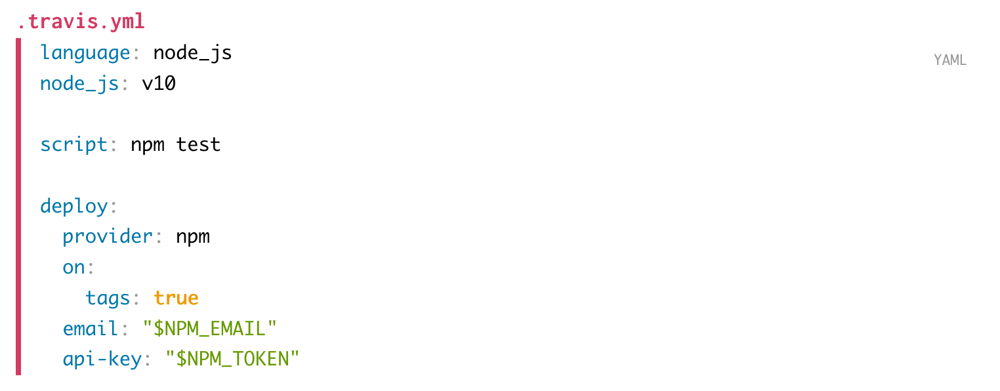

# asciidoctor-prism-extension [](https://travis-ci.org/oncletom/asciidoctor-prism-extension)

> Highlight Asciidoc code listings with Prism.js, server side, with no front-end dependencies.

This module is intended to be used with [Asciidoctor.js][], and Node.js (v10+). It adds a new syntax highlighter, to be used when converting Asciidoc to HTML5 documents. The syntax highlighting happens during the document conversion.



# Install

```bash
$ npm install @asciidoctor/core asciidoctor-prism-extension
```

# Configure

## Register the extension

```js
const asciidoctor = require('@asciidoctor/core')();
const prismExtension = require('asciidoctor-prism-extension');

asciidoctor.SyntaxHighlighter.register('prism', prismExtension);
```

## Change the rendering

This extension relies on [Asciidoc attributes](asciidoc-attributes) to affect the **theme** and the **highlighted syntaxes**.

```asciidoc
= Document
:source-highlighter: prism
:prism-languages: bash,docker,jsx

...
```

| Attribute         | Default     | Possible values
| ---               | ---         | ---
| `prism-theme`     | `prism.css` | [Any filename in this list][prism-themes].
| `prism-languages` | `asciidoc,bash,json,markdown,typescript,yaml` | [Any supported language][prism-languages].

Theme can be disabled with the negated attribute (`!` character):

```asciidoc
= Document
:source-highlighter: prism
:prism-theme!:
:prism-languages: bash,docker,jsx

...
```

## Render document

Then you convert as usual:

```js
asciidoctor.convertFile('document.adoc', {
  to_file: 'document.html',
  backend: 'html5'
});
```

**Note**: attributes can be specified at this stage too. [Have a look at Asciidoctor.js API][asciidoc-api] to learn more about it.

# Use

Author your documents as you would regularly do. The second argument of a _code listing_ hints the language to the syntax highlighter.

In the following example, `yaml` is going to be used to colour the output:

```asciidoc
[source,yaml]
.example.yml
----
language: node_js
node_js: node

script: npm test
----
```

# About

## Prism

[Prism][] is a highly configurable **syntax highlighter**.

## License

[MIT](LICENSE).

[Prism]: https://prismjs.com
[prism-themes]: https://github.com/PrismJS/prism/tree/master/themes
[prism-languages]: https://prismjs.com/#languages-list
[Asciidoctor.js]: https://github.com/asciidoctor/asciidoctor.js/
[Asciidoctor]: https://asciidoctor.org
[asciidoc-api]: https://github.com/asciidoctor/asciidoctor.js/blob/master/docs/manual.adoc#api
[asciidoc-code-blocks]: https://asciidoctor.org/docs/user-manual/#source-code-blocks
[asciidoc-attributes]: https://asciidoctor.org/docs/user-manual/#attributes
